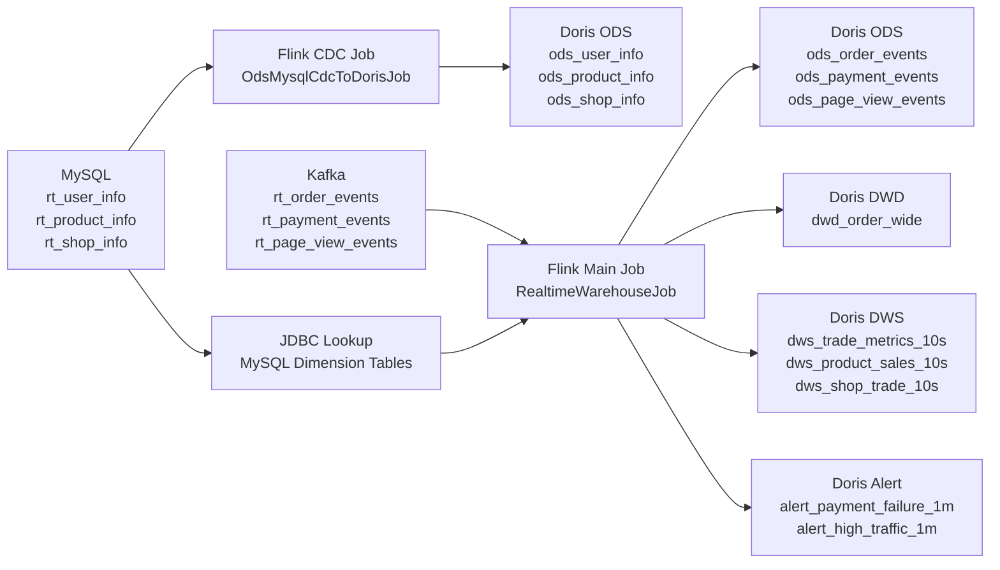

# Flink Enterprise Realtime Demo

这是一个可落地的企业级实时数仓 Demo，基于远程服务器 `bigdata` 实际联调通过。

核心链路：

- MySQL 维表 -> Flink CDC -> ODS -> Doris
- Kafka 事实流 -> Flink -> ODS / DWD / DWS / Alert -> Doris
- Doris 统一承担查询出口

## 1. 项目架构



## 2. 业务设计

采用电商实时分析场景。

MySQL 维表：

- `rt_user_info`
- `rt_product_info`
- `rt_shop_info`

Kafka 事实流：

- `rt_order_events`
- `rt_payment_events`
- `rt_page_view_events`

目标分层：

- ODS：保留原始维表和原始事件流
- DWD：构建订单宽表 `dwd_order_wide`
- DWS：输出 10 秒级交易指标、商品销售指标、店铺交易指标
- Alert：输出支付失败率告警、流量异常告警

## 3. 任务说明

### 3.1 ODS 任务

主类：

- `com.study.realtime.jobs.OdsMysqlCdcToDorisJob`

作用：

- 读取 MySQL `test` 库中的三张维表
- 通过 Flink CDC 实时同步到 Doris ODS 层

### 3.2 主链路任务

主类：

- `com.study.realtime.jobs.RealtimeWarehouseJob`

作用：

- 读取 Kafka 订单、支付、浏览三类事件
- 明细直接写入 Doris ODS
- 使用 MySQL JDBC lookup 关联维表，生成 `dwd_order_wide`
- 基于事件时间窗口产出 DWS 指标和告警结果

说明：

- 原方案尝试使用 `mysql-cdc FOR SYSTEM_TIME AS OF`
- 在当前 Flink 1.17.1 环境下出现 `Processing-time temporal join is not supported yet`
- 最终改为 `JDBC lookup join`，保留了宽表能力，并已在远端环境实测通过

## 4. 目录结构

```text
flink-enterprise-realtime-demo
├── PROJECT_REQUIREMENTS.md
├── README.md
├── pom.xml
├── scripts
│   ├── create_kafka_topics.sh
│   ├── doris_setup.sql
│   ├── generate_kafka_events.py
│   └── mysql_setup.sql
├── sql
│   ├── ods_mysql_cdc_to_doris.sql
│   └── realtime_warehouse.sql
└── src/main/java/com/study/realtime/jobs
    ├── FlinkSqlJobSupport.java
    ├── OdsMysqlCdcToDorisJob.java
    └── RealtimeWarehouseJob.java
```

## 5. 部署步骤

### 5.1 本地打包

```bash
cd /Users/autumn/IdeaProjects/study/flink/flink-enterprise-realtime-demo
mvn -q -DskipTests package
```

### 5.2 上传 jar

```bash
scp /Users/autumn/IdeaProjects/study/flink/flink-enterprise-realtime-demo/target/flink-enterprise-realtime-demo.jar \
  bigdata:/opt/module/flink-enterprise-realtime-demo/target/
```

### 5.3 提交 ODS CDC 任务

```bash
ssh bigdata 'cd /opt/module/flink-enterprise-realtime-demo && \
/opt/module/flink-1.17.1/bin/flink run-application -t yarn-application \
-Dyarn.application.name=rt-demo-ods-mysql-cdc \
-c com.study.realtime.jobs.OdsMysqlCdcToDorisJob \
target/flink-enterprise-realtime-demo.jar'
```

### 5.4 提交主链路任务

```bash
ssh bigdata 'cd /opt/module/flink-enterprise-realtime-demo && \
/opt/module/flink-1.17.1/bin/flink run-application -t yarn-application \
-Dyarn.application.name=rt-demo-main-pipeline \
-Djobmanager.memory.process.size=1024m \
-Dtaskmanager.memory.process.size=1024m \
-c com.study.realtime.jobs.RealtimeWarehouseJob \
target/flink-enterprise-realtime-demo.jar'
```

## 6. 本次实测结果

远端主任务应用：

- `application_1778724721626_0005`

YARN 状态：

- `RUNNING`

本次写入的演示数据覆盖：

- 4 条订单事件
- 4 条支付事件
- 6 条浏览事件

已在 Doris 查询到以下结果：

- ODS：
  - `ods_order_events = 4`
  - `ods_payment_events = 4`
  - `ods_page_view_events = 6`
- DWD：
  - `dwd_order_wide = 4`
- DWS：
  - `dws_trade_metrics_10s = 1`
  - `dws_product_sales_10s = 3`
  - `dws_shop_trade_10s = 3`
- Alert：
  - `alert_payment_failure_1m = 1`
  - `alert_high_traffic_1m = 1`

## 7. 关键查询结果

### 7.1 订单宽表示例

`dwd_order_wide`

- `5004, 1001, Alice, VIP, Shanghai, 3002, Wireless Earbuds, Electronics, 199.00, 2002, Digital Hub, A, Shenzhen, 1, 199.00, CREATED`
- `5003, 1003, Carol, VIP, Hangzhou, 3003, Desk Lamp, Home, 89.00, 2003, Home Choice, B, Suzhou, 3, 267.00, CREATED`

### 7.2 交易指标示例

`dws_trade_metrics_10s`

- 窗口 `2026-05-14 12:02:10` 到 `2026-05-14 12:02:20`
- 下单数 `4`
- 下单人数 `3`
- GMV `690.00`

### 7.3 告警示例

`alert_payment_failure_1m`

- 店铺 `2002`
- 总支付 `3`
- 失败 `3`
- 失败率 `1.0000`

`alert_high_traffic_1m`

- 页面类型 `PRODUCT`
- 商品 `3002`
- 店铺 `2002`
- PV `6`

## 8. 生产实现建议

- ODS 维表同步与主实时任务拆开部署，便于故障隔离
- Kafka 事件主题建议按业务域继续细分
- 维表实时性要求极高时，可评估升级 Flink 版本或切换到更完善的维表存储方案
- 当前 Demo 适合作为实时数仓最小闭环样板，后续可以继续扩展：
  - 支付宽表
  - 商品排行榜
  - 用户漏斗指标
  - 告警外发到钉钉或企业微信
